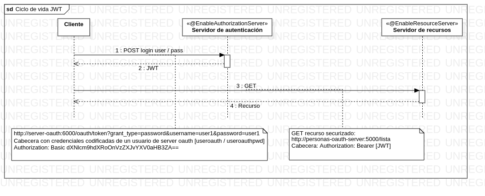

### JWT + Oauth2

JWT JSON Web Token JWT es un estándar RFC 7519 JWT Esta compuesto de tres partes separadas por un punto y codificadas en Base64

* Cabecera: metadata de encriptacion (metodo de encriptacion y tipo de token jwt)
* Payload: JSON encriptado con info del usuario y el authority; se puede añadir más datos (fecha, lugar...)
* Signature: firma para que verificar que el token es válido

**Ciclo de vida de un token JWT**
.
El cliente hace una peticion POST con usuario/password al servidor de autenticación que provee el token al cliente. El cliente hace la llamada al **servicio securizado** con ese token (en vez del usuario/password) El servidor comprueba los datos a partir de la firma y el método de encriptación (usualmente de clave simétrica).

### Spring Cloud Security

**Servidor de autenticacion**

	
	<dependency>
			<groupId>org.springframework.cloud</groupId>
			<artifactId>spring-cloud-starter-oauth2</artifactId>
	</dependency>

	@EnableAuthorizationServer
	
	http://localhost:6000/oauth
		
**Servidor de recursos**
	
	@EnableResourceServer	

	http://localhost:5000/lista
	
**Cliente**

	java -jar -Dspring.profiles.active=dev personas-client/target/personas-client-0.0.1-SNAPSHOT.jar
	
	http://localhost:8001/test -> 	GET:http://localhost:5000/lista
	http://localhost:8001/test-delete  ->  DELETE:http://localhost:5000/lista/uno@gmail.com
	
	LOGS: http://localhost:8001/actuator/logfile
	

+ info: [OAuth 2.0: equilibrio y usabilidad en la securización de APIs](https://www.paradigmadigital.com/dev/oauth-2-0-equilibrio-y-usabilidad-en-la-securizacion-de-apis/)
